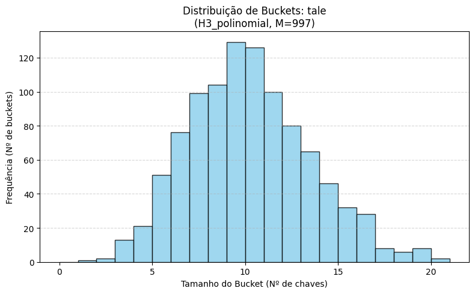
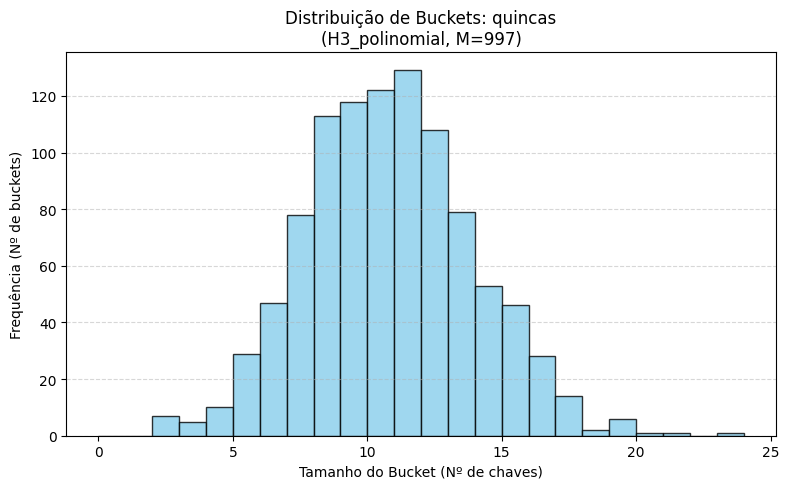

# Projeto 01 – Tabelas Hash em Textos Reais  
**Disciplina:** Estruturas de Dados II  
**Alunos:** Victor Hugo, Otavio Augusto, Samuel Teles  

---

## 1. Introdução

O objetivo deste trabalho foi implementar e analisar o comportamento de tabelas hash aplicadas a textos reais, com foco na influência das funções de hash e no impacto do tamanho da tabela.

Além disso, foi realizada uma comparação com uma estrutura linear (lista), utilizada como baseline, a fim de avaliar o ganho de desempenho obtido com o uso de hashing.

Os experimentos foram realizados utilizando os seguintes textos:

- *Tale of Two Cities* (Charles Dickens)  
- *Quincas Borba* (Machado de Assis)  

---

## 2. Pré-processamento dos dados

Antes da inserção das palavras nas estruturas, foi necessário realizar uma etapa de normalização dos textos.

No arquivo `main.py`, foi adotada a seguinte abordagem:

- Conversão de todo o texto para letras minúsculas  
- Utilização de expressão regular para extração das palavras  

Expressão utilizada:

`[a-záàâãéèêíïóôõöúçñ]+`

Essa escolha garante que apenas palavras válidas sejam consideradas, ignorando números e pontuação, além de preservar caracteres acentuados.

Após a tokenização, foi realizada a remoção de palavras repetidas por meio de uma função manual (`palavras_unicas`), respeitando a restrição de não utilizar estruturas prontas como `set`.

Para o texto *tale*, por exemplo, foram obtidas **9698 palavras distintas**, que foram utilizadas como chaves nos experimentos.

---

## 3. Estruturas implementadas

### 3.1 Tabela Hash

A tabela hash foi implementada utilizando **encadeamento separado**, onde cada posição da tabela (bucket) armazena uma lista de elementos.

As operações principais são:

- `put(p)`: insere a palavra caso ainda não exista  
- `contains(p)`: verifica se a palavra está presente  

Também foi utilizado um contador de comparações (`comp`) para medir o custo das operações de busca.

---

### 3.2 Estrutura Linear

Como base de comparação, foi implementada uma estrutura linear utilizando uma lista simples.

Nesse caso:

- A inserção verifica previamente a existência do elemento  
- A busca é feita de forma sequencial  

Essa abordagem apresenta custo linear e serve como referência para avaliar a eficiência da tabela hash.

---

## 4. Funções de hash

Foram implementadas cinco funções de hash distintas:

- **H1 – Soma dos caracteres:** função simples baseada na soma dos valores ASCII  
- **H2 – Soma posicional:** considera a posição de cada caractere na palavra  
- **H3 – Polinomial (Horner):** utiliza multiplicação por uma constante (R = 31)  
- **H4 – XOR com deslocamento:** realiza mistura de bits utilizando operações XOR e shift  
- **H5 – Função ruim:** considera apenas o primeiro caractere da palavra  

A inclusão da função ruim teve como objetivo evidenciar o impacto negativo de uma função de hash mal projetada.

---

## 5. Configuração dos experimentos

Os testes foram realizados variando o tamanho da tabela (M):

- M = 97 (número primo)  
- M = 100 (não primo)  
- M = 997 (número primo maior)  

Para cada combinação de texto, função de hash e valor de M, foram coletadas as seguintes métricas:

- número de palavras distintas (n)  
- fator de carga (α = n / M)  
- maior tamanho de bucket (max_bucket)  
- desvio padrão da distribuição  
- número de comparações em buscas:
  - com sucesso  
  - sem sucesso  

Os resultados foram armazenados no arquivo `resultados.csv`.

---

## 6. Análise dos resultados

### 6.1 Distribuição dos dados e colisões

A análise dos resultados mostrou diferenças claras entre as funções de hash.

Considerando o texto *tale* com M = 97:

- H1 (soma): max_bucket = 153  
- H3 (polinomial): max_bucket = 119  
- H4 (xor): max_bucket = 126  

Além disso, o desvio padrão apresentou os seguintes valores:

- H1: 24.67  
- H3: 10.30  
- H4: 8.96  

Esses valores indicam que funções mais simples, como H1, tendem a concentrar elementos em poucos buckets, aumentando o número de colisões. Já funções mais elaboradas distribuem melhor os dados.

# 6.1.2 Histogramas de distribuição

Para complementar a análise da distribuição dos dados na tabela hash, foram gerados histogramas considerando a função H3 (polinomial) com M = 997.

Essa configuração foi escolhida por apresentar um dos melhores desempenhos entre os cenários avaliados.

##### Texto: Tale of Two Cities



O histograma demonstra uma distribuição relativamente uniforme dos elementos entre os buckets, indicando que a função de hash foi eficiente na dispersão das palavras.

A maior parte dos buckets apresenta tamanhos próximos, sem a formação de grandes concentrações, o que reduz o número de colisões e melhora o desempenho das operações de busca.

##### Texto: Quincas Borba



Observa-se uma distribuição aproximadamente uniforme, com a maioria dos buckets contendo valores próximos entre si.

Esse comportamento indica que a função de hash conseguiu distribuir bem os dados, evitando agrupamentos excessivos (clustering).

Além disso, há poucos casos de buckets com valores extremos, o que reforça a qualidade da função de espalhamento utilizada.
---

### 6.2 Custo de busca na tabela hash

Para o mesmo cenário (tale, M = 97):

#### Busca com sucesso:
- H1: aproximadamente 53 comparações  
- H3: aproximadamente 51 comparações  
- H4: aproximadamente 50 comparações  

#### Busca sem sucesso:
- H1: aproximadamente 116 comparações  
- H3: aproximadamente 99 comparações  
- H4: aproximadamente 99 comparações  

Observa-se que funções com melhor distribuição reduzem o número médio de comparações.

---

### 6.3 Comparação com a estrutura linear

Os resultados da busca linear foram significativamente superiores em termos de custo:

- Busca com sucesso: ~4849 comparações  
- Busca sem sucesso: ~9698 comparações  

Comparando com a tabela hash:

- Hash (H3): ~51 comparações  
- Linear: ~4849 comparações  

Isso evidencia um ganho de desempenho muito significativo ao utilizar hashing.

---

### 6.4 Influência do tamanho da tabela

Foi possível observar que:

- Tabelas com tamanho primo (97 e 997) apresentaram melhor distribuição  
- O uso de M = 100 resultou em maior número de colisões  

Isso reforça a importância da escolha adequada do tamanho da tabela.

---

### 6.5 Fator de carga

Para o caso do texto *tale* com M = 97:

- α ≈ 99.97  

Esse valor elevado indica que há muitos elementos por bucket, o que impacta diretamente no custo das buscas. Mesmo assim, a tabela hash ainda apresentou desempenho muito superior à estrutura linear.

---

## 7. Conclusão

A partir dos experimentos realizados, foi possível concluir que:

- A tabela hash apresenta desempenho significativamente superior à busca linear  
- A escolha da função de hash é um fator determinante para a eficiência da estrutura  
- Funções como a polinomial e a baseada em XOR apresentaram melhores resultados  
- Funções simples ou inadequadas aumentam consideravelmente o número de colisões  

Além disso, verificou-se que:

- O uso de números primos para o tamanho da tabela melhora a distribuição  
- Fatores de carga elevados impactam negativamente o desempenho, mas não eliminam a vantagem da hash  

---

## 8. Considerações finais

O desenvolvimento deste trabalho permitiu observar, na prática, conceitos importantes de estruturas de dados, como colisões, fator de carga e eficiência de busca.

De forma geral, ficou evidente que a implementação de uma tabela hash eficiente depende não apenas da estrutura em si, mas também da escolha adequada da função de hash e dos parâmetros utilizados.

---

## 9. Execução do projeto

Para executar o projeto, utilize:

```bash
python main.py
